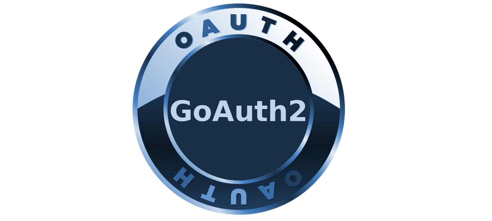

A complete standalone Oauth2 Server RFC 6749 implementation written in Golang and licensed under the GPL V3 license.

### [Installation](https://github.com/Ulbora/GoAuth2/wiki/Installation)

### [Documentation](https://github.com/Ulbora/GoAuth2/wiki)

---

GoAuth2 is an Oauth2 server implementation written in Golang and the security layer for <a href="https://github.com/Ulbora/Six910" target="_blank">Six910 open source eCommerce solution</a>. Currently authorization code, 
implicit, and client credentials grant, and password grant types are supported.

GoAuth2 issues a compressed enhanced JWT token that can be used to secure individual REST endpoints for users using roles. REST endpoints can be coded to validate the JWT token using the user's role. There is also a access token REST service that can validate a compressed token. Token compression can be turned off at startup if desired.

---

### GoAuth2 will provide the security infrastructure for <a href="https://github.com/Ulbora/Six910" target="_blank">Six910 the new open source eCommerce Platform solution from Ulbora Labs LLC</a>, Six910.
#### (Six910 is an eCommerce Platform server solution written in golang that provides REST endpoints for backend operations. Six910 frontend soltutions is also written in golang.)

---

This server should run behind nginx and nginx should handle certs.

If you would **like to contribute** to this project, **send a pull request**.

Contributors:
Ken Williamson

